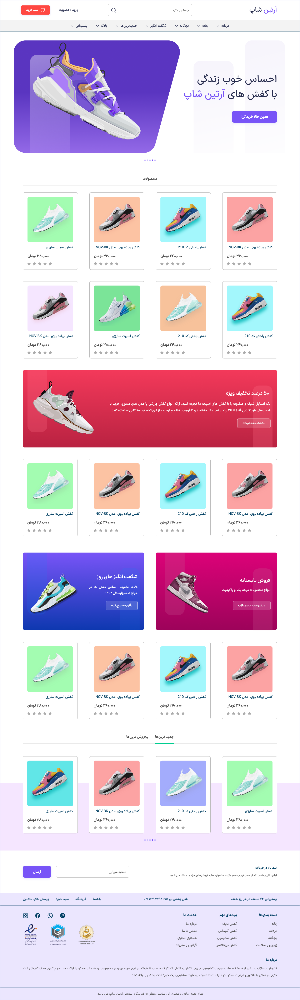

## Shoe Store (Next JS)
This project currently only has the Home page and will be developed soon

Use ``` npm run server ``` command to start Json Server on port 4000

developed and codeing by <a href="https://github.com/vcabolfazl">Abolfazl Sharifi</a> and Ui design by <a href="https://www.figma.com/@farzane_m">Farzaneh Mojtabavi</a>
### Technologies used :
- Next JS
- React JS
- React Query
- Json Server
- Tailwindcss
- Css
- Swiper JS

### [Contact me through Telegram](https://t.me/vc_abolfazl)
### [Communication with Farzaneh Mojtabavi](https://fmojtabavi.ir)
## A view of the site

